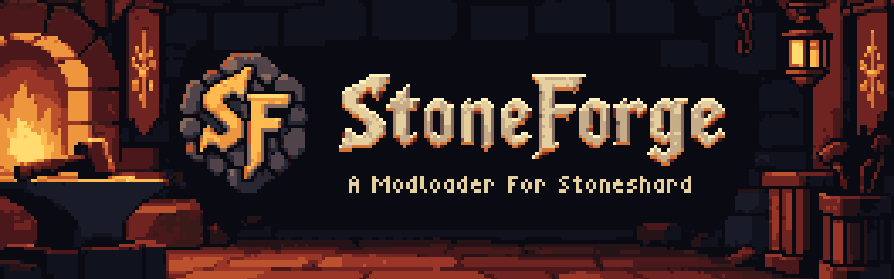

<p align="center"></p>

A C# mod loader for Stoneshard on Windows. Mods are source folders with a `mod.json` manifest, C# code and optional assets and GML bindings. StoneForge provides context APIs for items, consumables, buffs, skills, UI and game hooks.

## Requirements

- Stoneshard (Steam), works on both main and mod branches!.
- The **.NET 10 Windows Desktop Runtime, x64** for all mod types, including MSL packages. The base .NET 10 Runtime is sufficient only for ordinary StoneForge mods.
- To build: .NET 10 SDK and Visual Studio with MSBuild and C++ tools (the current native build uses toolset `v145`).

StoneForge uses UndertaleModLib 0.9.2.0 and Underanalyzer directly to patch game data. Game data is read from your local install; it is not included in this repository.

## Install

Download `StoneForge-<version>.zip` from [Releases](https://github.com/StoneForgeTeam/StoneForge/releases), or use a package you built under `artifacts/StoneForge-<version>`. Close Stoneshard, extract the release and run `Install StoneForge.cmd`. Launch the game normally afterward. Re-running the installer updates an existing installation; `Uninstall StoneForge.cmd` restores the preserved game files and keeps your mods.

Mod folders go in `<Stoneshard>/mods`. Open the in-game Mods window to enable or disable them. GML mods carry a warning: their scripts execute directly in GameMaker, outside the C# source restrictions, and need a game restart after edits.

## Build and test

From a Visual Studio developer PowerShell:

```powershell
msbuild StoneForge.slnx -restore -p:Configuration=Release -p:PlatformToolset=v145
dotnet test StoneForge.Tests -c Release --no-build
dotnet test StoneForge.Patcher.Tests -c Release --no-build
powershell -ExecutionPolicy Bypass -File build/Package.ps1 -NoBuild
```

The API build discovers Stoneshard through Steam. To choose another install, set `STONESHARD_DIR` or pass `-p:StoneshardDir="C:\path\to\Stoneshard"`. DataDump writes generated game metadata under `StoneForge.API/obj/GameData`. Integration tests use `STONEFORGE_TEST_DATA` or Steam's preserved `dotnet/data_base.win`; they skip when no suitable data is available.

Without Stoneshard, build the API from the small stand-in data in `build/StubGameData` instead. This is what the [Tests workflow](.github/workflows/tests.yml) does on GitHub for every pull request and push to `main`:

```powershell
dotnet test StoneForge.Tests -c Release -p:StoneForgeStubGameData=true
dotnet test StoneForge.Patcher.Tests -c Release
```

The stand-in holds only the game names StoneForge's own code and tests use. If you reference another generated name (`GameObjectId.x`, `Scripts.x`, `Events.x.y`, an object's variable...), add it there, or the Tests workflow fails to build. An API built this way is for testing only: never package it.

Pinned native binaries and their rebuild instructions are under `lib/Aurie`, `lib/YYToolkit` and `build/BuildThirdParty.ps1`. Library provenance and checksums are under `lib/UndertaleModLib`.

Publishing releases is for the StoneForgeTeam maintainers: see [RELEASING.md](RELEASING.md).

## MSL packages (VM modbranch only)

Drop `.sml` files directly into `<Stoneshard>/mods`, then start the game. Packages are enabled by default: only put mods you trust there. The Mods window shows their metadata and an unrestricted-code warning; untick Enabled to switch a package off on the next start. File names identify packages, so renaming a disabled package makes it a new, enabled package. Metadata is collected during patching and cached; disabled packages are not executed merely to display their details.

Enabled packages run in filename order through the bundled MSL 0.13.2.0 compatibility helper, followed by StoneForge's patches. No separate MSL installation is needed. Adding, changing, disabling or removing packages rebuilds from the preserved base on the next start. Changes are not hot-reloaded. The preserved base must be clean modbranch data, not previously MSL-patched data.

MSL mods execute unrestricted C# during preparation. The helper's separate process isolates its older dependencies, not its permissions. Packages depending on MSL's launcher UI or scripting server are unsupported; compatibility with individual mods still depends on the game and MSL API version. Logs are in `dotnet/msl-patch.log`. Failed patching leaves the last game data in place; do not assume a changed mod selection was applied after an error.

## Write a StoneForge mod

The documentation lives in the [StoneForgeDocs](https://github.com/StoneForgeTeam/StoneForgeDocs) repository and is published with GitBook.

- [Mod manifests and content IDs](https://github.com/StoneForgeTeam/StoneForgeDocs/blob/main/docs/modding/writing-a-mod.md)
- [GML bindings](https://github.com/StoneForgeTeam/StoneForgeDocs/blob/main/docs/modding/gml-bindings.md)
- [API lifetime rules](https://github.com/StoneForgeTeam/StoneForgeDocs/blob/main/docs/modding/api-lifetime-rules.md)
- [Building, testing and the developer host](https://github.com/StoneForgeTeam/StoneForgeDocs/blob/main/docs/development/building-and-testing.md)
- [Example Mod](https://github.com/StoneForgeTeam/ExampleMod): the separate sample repository for items, buffs, skills, UI and GML.

The example builds against an installed StoneForge SDK and has its own release history. See [repository layout](https://github.com/StoneForgeTeam/StoneForgeDocs/blob/main/docs/development/repositories.md) for the organization and repository boundaries.

## License

StoneForge's source license is in [LICENSE](LICENSE). Native components and game-data libraries have their own licenses and provenance in `lib/`; release notices are in [THIRD-PARTY.txt](build/release/LICENSES/THIRD-PARTY.txt). Stoneshard and its game data belong to their respective owners.

See [CHANGELOG.md](CHANGELOG.md) for the development history and compatibility changes.
